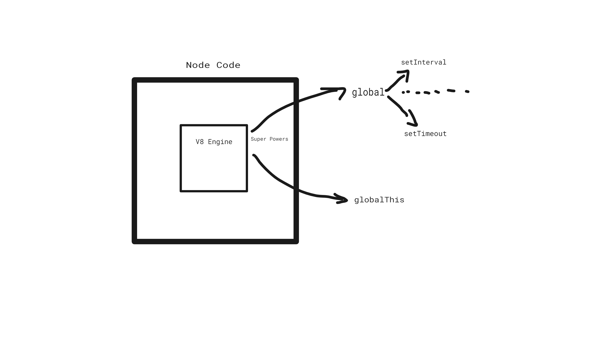
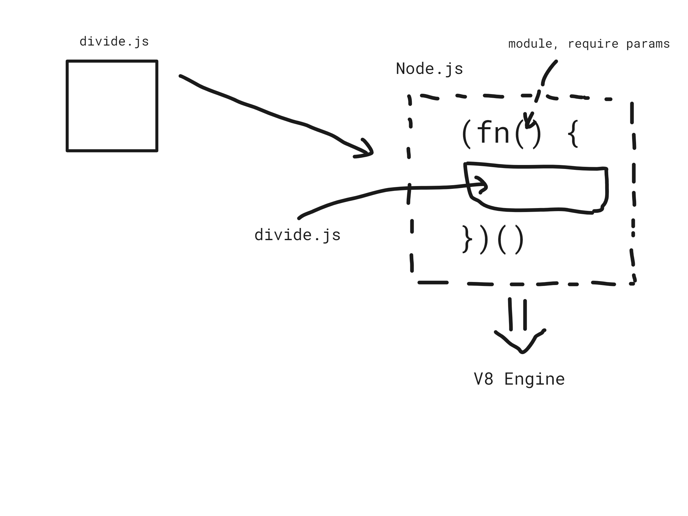

# Namaste Node Notes

### Intro to Node.js
---

"Any application that can be written in JavaScript, will eventually be written in JavaScript"
            
    Jeff Atwood, 2007, Stackoverflow Founder

Node JS 
- cross platform (can run in Windows, Linux, etc)
- executes JavaScript outside the browser

History
- 2009 -> Ryan Dahl created Node Js

Spider Monkey (Firefox) &&
V8 (Google Chrome) 

Dahl started to built Node on Spider Monkey and after two days he switched to V8.

First name of Node js was Web.js -> creating web servers.

- 2010 -> NPM

- 2011 -> Windows Support

- 2012 -> Isaac (NPM) started maintaining Node js

- 2014 -> Fedor forked Node js repo and created Io.js

- 2015 -> Node js Foundation

- 2019 -> JS Foundation + Node js Foundation = Open JS Foundation

### JS on Server
---

Server - remote computer

NodeJs is a C++ application with V8 embedded into it.

ECMASCRIPT - Standards / Rules (JS Engines follow these standards)

Computers understand only BINARY CODE.

Computer

JS => HIGH LEVEL LANGUAGES (C++) => MACHINE CODE => ASSEMBLY CODE => BINARY CODE

### Writting Code
---

By running "node" in the terminal you can run node in the node repl. (Read, Evaluate, Print, Loop).

Node js is a JS Runtime Environment.

`
console.log(this)
`
This line prints an empty object

### Module.exports && Require
---

Modules protect their variables and functions from leaking. 

|               | Common JS Modules (cjs) | ES Modules (mjs) |
| :---------------- | :------: | ----: |
|        |   module.exports / require()   | import export |
|           |   older way   | newer way |
|    |  synchronous calls   | async option |
|  |  non strict mode   | strict mode |
|  |  very popular in the Industry   |  |

### Diving into the Node.js github repo
---

require("./path")

All the code of the module is wrapped inside a function named IIFE.

Q. Why do we need IIFEs?

- imediately invokes the code
- keeps the variables and functions safe (private)

Q. How are variables and functions private in different modules?

- because of IIFEs and require

Q. How do we get access to module.exports?

- Through Node
- Node js parses module as a parameter to the IIFE

#require(/path)

1. Resolving the module
- local path
- json -> node:module

2. Loading the module
- file content is loaded

3. Wraps inside IIFE

4. Evaluation -> module.exports

5. Caching

- If I have three files that require a specific module, e.g. require("./xyz.js") the module is run only once, the others two are coming from the cache.

### libuv & async IO
---

JS -> synchronous single threaded

##### SYNCHRONOUS CODE EXECUTION IN JS
---

TO BE CONTINUED
